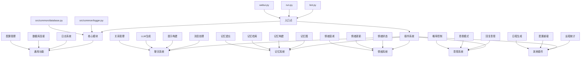
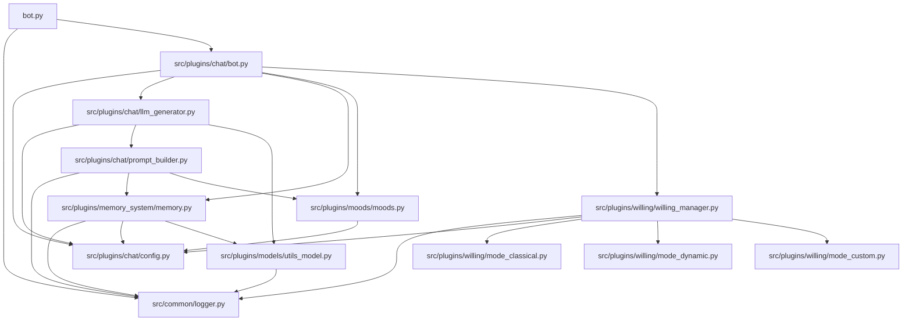
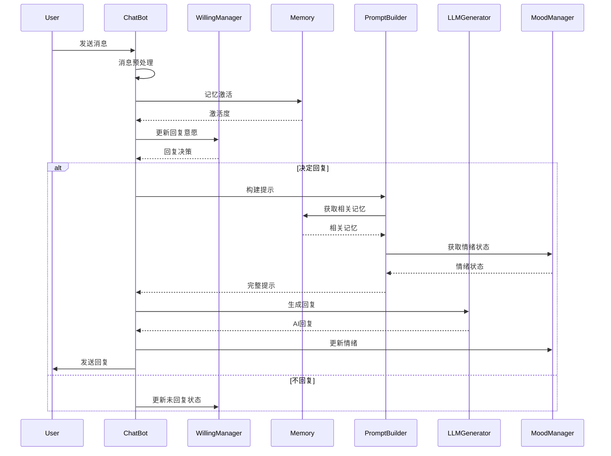

# MaiMBot 开发文档

## 📊 系统架构图

## 📁 核心文件索引

| 功能 | 文件路径 | 描述 |
|------|----------|------|
| **入口点** | `/bot.py` | 主入口，初始化环境和启动服务 |
| | `/run.py` | 安装管理脚本，主要用于Windows |
| | `/webui.py` | Gradio基础的配置UI |
| **配置** | `/template.env` | 环境变量模板 |
| | `/template/bot_config_template.toml` | 机器人配置模板 |
| **核心基础** | `/src/common/database.py` | MongoDB连接管理 |
| | `/src/common/logger.py` | 基于loguru的日志系统 |
| **聊天系统** | `/src/plugins/chat/bot.py` | 消息处理核心逻辑 |
| | `/src/plugins/chat/config.py` | 配置管理与验证 |
| | `/src/plugins/chat/llm_generator.py` | LLM响应生成 |
| | `/src/plugins/chat/prompt_builder.py` | LLM提示构建 |
| **记忆系统** | `/src/plugins/memory_system/memory.py` | 图结构记忆实现 |
| | `/src/plugins/memory_system/draw_memory.py` | 记忆可视化 |
| **情绪系统** | `/src/plugins/moods/moods.py` | 情绪状态管理 |
| **意愿系统** | `/src/plugins/willing/willing_manager.py` | 回复意愿管理 |
| | `/src/plugins/willing/mode_classical.py` | 经典意愿模式 |
| | `/src/plugins/willing/mode_dynamic.py` | 动态意愿模式 |
| | `/src/plugins/willing/mode_custom.py` | 自定义意愿模式 |

## 🔄 模块依赖关系

## 🔄 消息处理流程

## 📋 类和功能清单

### 🤖 聊天系统 (`src/plugins/chat/`)

| 类/功能 | 文件 | 描述 |
|--------|------|------|
| `ChatBot` | `bot.py` | 消息处理主类 |
| `ResponseGenerator` | `llm_generator.py` | 响应生成器 |
| `PromptBuilder` | `prompt_builder.py` | 提示构建器 |
| `Message`系列 | `message.py` | 消息表示类 |
| `RelationshipManager` | `relationship_manager.py` | 用户关系管理 |
| `EmojiManager` | `emoji_manager.py` | 表情符号管理 |

### 🧠 记忆系统 (`src/plugins/memory_system/`)

| 类/功能 | 文件 | 描述 |
|--------|------|------|
| `Memory_graph` | `memory.py` | 图结构记忆存储 |
| `Hippocampus` | `memory.py` | 记忆管理主类 |
| `memory_compress()` | `memory.py` | 记忆压缩函数 |
| `get_relevant_memories()` | `memory.py` | 记忆检索函数 |
| `operation_forget_topic()` | `memory.py` | 记忆遗忘函数 |

### 😊 情绪系统 (`src/plugins/moods/`)

| 类/功能 | 文件 | 描述 |
|--------|------|------|
| `MoodManager` | `moods.py` | 情绪管理器单例 |
| `MoodState` | `moods.py` | 情绪状态数据类 |
| `update_mood_from_emotion()` | `moods.py` | 情绪更新函数 |
| `_apply_decay()` | `moods.py` | 情绪衰减函数 |

### 🤔 意愿系统 (`src/plugins/willing/`)

| 类/功能 | 文件 | 描述 |
|--------|------|------|
| `WillingManager` | `willing_manager.py` | 意愿管理工厂类 |
| `ClassicalWillingManager` | `mode_classical.py` | 经典意愿模式 |
| `DynamicWillingManager` | `mode_dynamic.py` | 动态意愿模式 |
| `CustomWillingManager` | `mode_custom.py` | 自定义意愿模式 |

## 🔧 常用命令

- **运行机器人**: `python run.py` 或 `python bot.py`
- **安装依赖**: `pip install --upgrade -r requirements.txt`
- **Docker 部署**: `docker-compose up`
- **代码检查**: `ruff check .`
- **代码格式化**: `ruff format .`
- **内存可视化**: `run_memory_vis.bat` 或 `python -m src.plugins.memory_system.draw_memory`
- **推理过程可视化**: `script/run_thingking.bat`

## 🔧 脚本工具

- **运行MongoDB**: `script/run_db.bat` - 在端口27017启动MongoDB
- **Windows完整启动**: `script/run_windows.bat` - 检查Python版本、设置虚拟环境、安装依赖并运行机器人
- **快速启动**: `script/run_maimai.bat` - 设置UTF-8编码并执行"nb run"命令

## 📝 代码风格

- **Python版本**: 3.9+
- **行长度限制**: 88字符
- **命名规范**:
  - `snake_case` 用于函数和变量
  - `PascalCase` 用于类
  - `_prefix` 用于私有成员
- **导入顺序**: 标准库 → 第三方库 → 本地模块
- **异步编程**: 对I/O操作使用async/await
- **日志记录**: 使用loguru进行一致的日志记录
- **错误处理**: 使用带有具体异常的try/except
- **文档**: 为类和公共函数编写docstrings

## 📋 常见修改点

### 配置修改
- **机器人配置**: `/template/bot_config_template.toml`
- **环境变量**: `/template.env`

### 行为定制
- **个性调整**: `src/plugins/chat/config.py` 中的 BotConfig 类
- **回复意愿算法**: `src/plugins/willing/mode_classical.py`
- **情绪反应模式**: `src/plugins/moods/moods.py`

### 消息处理
- **消息管道**: `src/plugins/chat/message.py`
- **话题识别**: `src/plugins/chat/topic_identifier.py`

### 记忆与学习
- **记忆算法**: `src/plugins/memory_system/memory.py`
- **手动记忆构建**: `src/plugins/memory_system/memory_manual_build.py`

### LLM集成
- **LLM提供商**: `src/plugins/chat/llm_generator.py`
- **模型参数**: `template/bot_config_template.toml` 的 [model] 部分