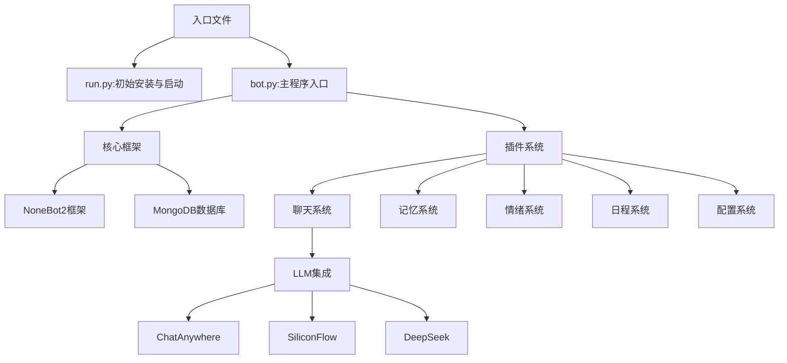
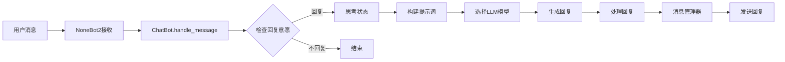
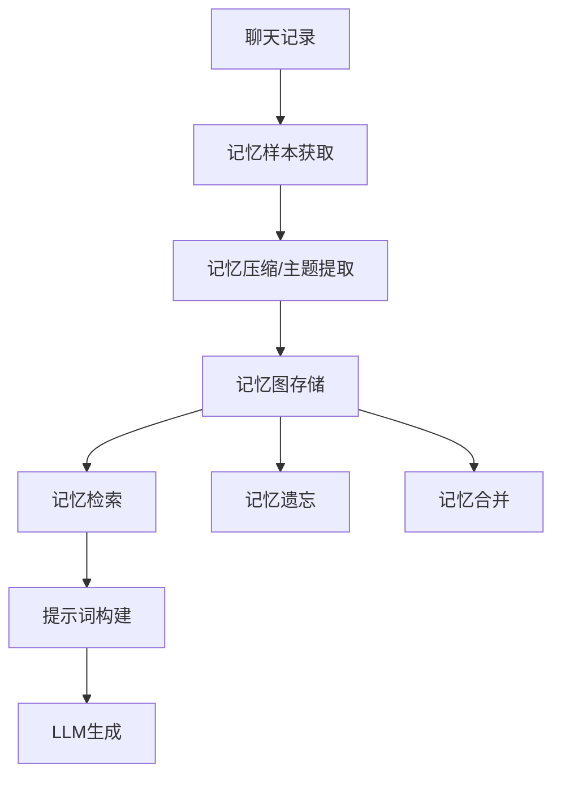
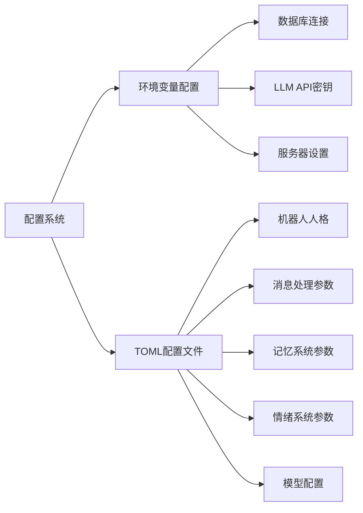
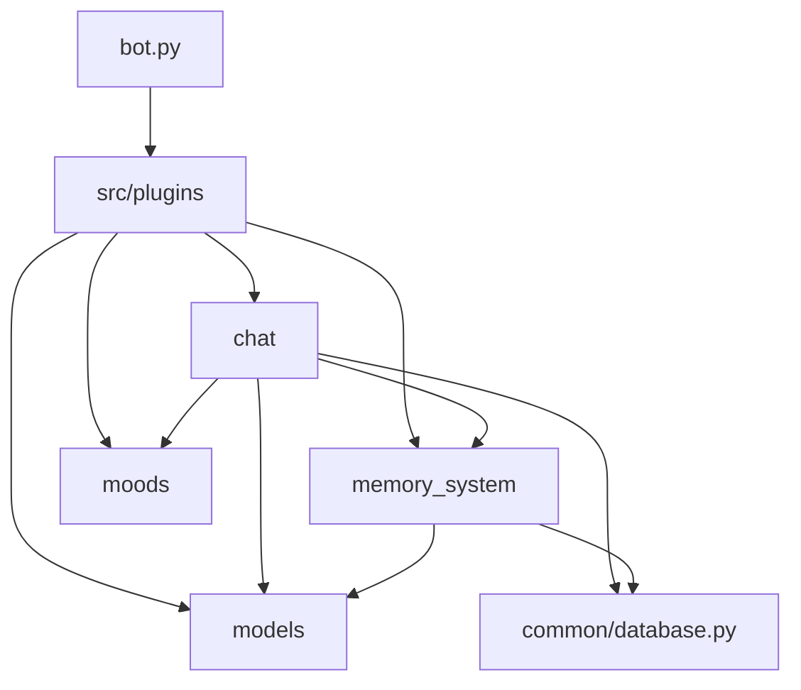

# MaiMBot 项目架构与索引指南

## 🛠️ 常用命令

- **运行机器人**: `python run.py` 或 `python bot.py`
- **安装依赖**: `pip install --upgrade -r requirements.txt`
- **Docker 部署**: `docker-compose up`
- **代码检查**: `ruff check .`
- **代码格式化**: `ruff format .`
- **内存可视化**: `run_memory_vis.bat` 或 `python -m src.plugins.memory_system.draw_memory`
- **推理过程可视化**: `script/run_thingking.bat`

## 🔧 脚本工具

- **运行MongoDB**: `script/run_db.bat` - 在端口27017启动MongoDB
- **Windows完整启动**: `script/run_windows.bat` - 检查Python版本、设置虚拟环境、安装依赖并运行机器人
- **快速启动**: `script/run_maimai.bat` - 设置UTF-8编码并执行"nb run"命令

## 📝 代码风格

- **Python版本**: 3.9+
- **行长度限制**: 88字符
- **命名规范**:
  - `snake_case` 用于函数和变量
  - `PascalCase` 用于类
  - `_prefix` 用于私有成员
- **导入顺序**: 标准库 → 第三方库 → 本地模块
- **异步编程**: 对I/O操作使用async/await
- **日志记录**: 使用loguru进行一致的日志记录
- **错误处理**: 使用带有具体异常的try/except
- **文档**: 为类和公共函数编写docstrings

## 🔍 项目结构概览

## 📁 关键文件索引

| 文件路径 | 功能描述 |
|---------|---------|
| `/bot.py` | 主程序入口，初始化框架和插件加载 |
| `/run.py` | 初始安装脚本，配置MongoDB和启动机器人 |
| `/src/plugins/chat/bot.py` | 聊天核心处理，消息接收与分发 |
| `/src/plugins/chat/llm_generator.py` | LLM交互封装，生成回复内容 |
| `/src/plugins/chat/prompt_builder.py` | 构建提示词，整合上下文和记忆 |
| `/src/plugins/memory_system/memory.py` | 图形记忆系统核心实现 |
| `/src/plugins/moods/moods.py` | 情绪管理系统 |
| `/src/common/database.py` | 数据库连接管理 |
| `/src/plugins/models/utils_model.py` | LLM API请求封装 |
| `/template.env` | 环境变量配置模板 |
| `/template/bot_config_template.toml` | 机器人配置模板 |

## 🔄 核心流程图

### 消息处理流程

### 记忆系统流程

## ⚙️ 配置系统概览

## 📊 模块依赖关系

## 🧠 记忆系统内部结构

- **Memory_graph**: 底层图结构实现
  - 节点 = 主题概念
  - 边 = 主题间关联
  - 属性 = 记忆内容、时间戳

- **Hippocampus**: 高级记忆管理
  - 记忆构建: `memory_compress()`
  - 记忆检索: `get_relevant_memories()`
  - 记忆遗忘: `operation_forget_topic()`
  - 记忆合并: `operation_merge_memory()`

- **LLM集成点**:
  - 主题提取
  - 记忆摘要生成
  - 相似度计算
  - 记忆压缩

## 💬 聊天系统内部结构

- **ChatBot**: 核心控制器
  - 消息处理: `handle_message()`
  - 响应生成: `generate_response()`

- **消息处理链**:
  - `MessageRecv` → 消息预处理
  - `willing_manager` → 回复决策
  - `prompt_builder` → 提示词构建
  - `LLM_request` → LLM调用
  - `MessageSending` → 消息发送

- **关键组件**:
  - 消息管理器: 控制消息流
  - 聊天流管理: 维护会话上下文
  - 关系管理器: 用户关系状态
  - 表情管理器: 表情包处理

## 🔧 配置项关键参数

### 环境变量 (.env)
- MongoDB连接: `MONGODB_HOST`, `MONGODB_PORT`, `DATABASE_NAME`
- LLM API: `CHAT_ANY_WHERE_KEY`, `SILICONFLOW_KEY`, `DEEP_SEEK_KEY`
- 服务设置: `HOST`, `PORT`

### 机器人配置 (TOML)
- 版本控制: `[inner].version`
- 人格设置: `[personality]`
- 记忆参数: `[memory]` (构建间隔、压缩率、遗忘周期)
- 情绪参数: `[mood]` (更新间隔、衰减率)
- 模型选择: `[model]` (各功能专用模型配置)