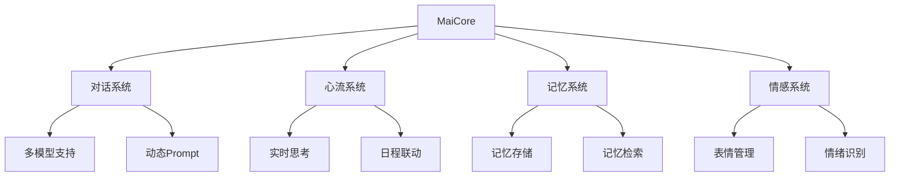

# 麦麦！MaiCore-MaiMBot (编辑中)
 

  
  
  
  
  
  
  

  

  
   
  <a href="https://space.bilibili.com/1344099355">
    画师：略nd
  </a>

  <h3 align="center">MaiBot(麦麦)</h3>
  

    一款专注于<strong> 群组聊天 </strong>的赛博网友
     
    <a href="https://docs.mai-mai.org"><strong>探索本项目的文档 »</strong></a>
     
     
    <!-- <a href="https://github.com/shaojintian/Best_README_template">查看Demo</a>
    · -->
    <a href="https://github.com/MaiM-with-u/MaiBot/issues">报告Bug</a>
    ·
    <a href="https://github.com/MaiM-with-u/MaiBot/issues">提出新特性</a>
  

## 新版0.6.x部署前先阅读：https://docs.mai-mai.org/manual/usage/mmc_q_a

## 📝 项目简介

**🍔MaiCore是一个基于大语言模型的可交互智能体**

- 💭 **智能对话系统**：基于LLM的自然语言交互
- 🤔 **实时思维系统**：模拟人类思考过程
- 💝 **情感表达系统**：丰富的表情包和情绪表达
- 🧠 **持久记忆系统**：基于MongoDB的长期记忆存储
- 🔄 **动态人格系统**：自适应的性格特征

<a href="https://www.bilibili.com/video/BV1amAneGE3P" target="_blank">
    
     
    👆 点击观看麦麦演示视频 👆
</a>

### 📢 版本信息

**最新版本: v0.6.3** ([查看更新日志](changelogs/changelog.md))
> [!WARNING]
> 请阅读教程后更新！！！！！！！
> 请阅读教程后更新！！！！！！！
> 请阅读教程后更新！！！！！！！
> 次版本MaiBot将基于MaiCore运行，不再依赖于nonebot相关组件运行。
> MaiBot将通过nonebot的插件与nonebot建立联系，然后nonebot与QQ建立联系，实现MaiBot与QQ的交互

**分支说明：**
- `main`: 稳定发布版本
- `dev`: 开发测试版本（不知道什么意思就别下）
- `classical`: 0.6.0之前的版本

> [!WARNING]
> - 项目处于活跃开发阶段，代码可能随时更改
> - 文档未完善，有问题可以提交 Issue 或者 Discussion
> - QQ机器人存在被限制风险，请自行了解，谨慎使用
> - 由于持续迭代，可能存在一些已知或未知的bug
> - 由于开发中，可能消耗较多token

### ⚠️ 重要提示

- 升级到v0.6.x版本前请务必阅读：[升级指南](https://docs.mai-mai.org/manual/usage/mmc_q_a)
- 本版本基于MaiCore重构，通过nonebot插件与QQ平台交互
- 项目处于活跃开发阶段，功能和API可能随时调整

### 💬交流群（开发和建议相关讨论）不一定有空回复，会优先写文档和代码
- [一群](https://qm.qq.com/q/VQ3XZrWgMs) 766798517 
- [二群](https://qm.qq.com/q/RzmCiRtHEW) 571780722
- [五群](https://qm.qq.com/q/JxvHZnxyec) 1022489779
- [三群](https://qm.qq.com/q/wlH5eT8OmQ) 1035228475【已满】
- [四群](https://qm.qq.com/q/wlH5eT8OmQ) 729957033【已满】

<h2>📚 文档 </h2>

### (部分内容可能过时，请注意版本对应)

### 核心文档
- [📚 核心Wiki文档](https://docs.mai-mai.org) - 项目最全面的文档中心，你可以了解麦麦有关的一切

### 最新版本部署教程(MaiCore版本)
- [🚀 最新版本部署教程](https://docs.mai-mai.org/manual/deployment/mmc_deploy_windows.html) - 基于MaiCore的新版本部署方式（与旧版本不兼容）

## 🎯 0.6.3 功能介绍

| 模块       | 主要功能                                                             | 特点    |
|----------|------------------------------------------------------------------|-------|
| 💬 聊天系统  | • **统一调控不同回复逻辑** • 智能交互模式 (普通聊天/专注聊天) • 关键词主动发言 • 多模型支持 • 动态prompt构建 • 私聊功能(PFC)增强 | 拟人化交互 |
| 🧠 心流系统  | • 实时思考生成 • **智能状态管理** • **概率回复机制** • 自动启停机制 • 日程系统联动 • **上下文感知工具调用** | 智能化决策 |
| 🧠 记忆系统  | • **记忆整合与提取** • 海马体记忆机制 • 聊天记录概括 | 持久化记忆 |
| 😊 表情系统  | • **全新表情包系统** • **优化选择逻辑** • 情绪匹配发送 • GIF支持 • 自动收集与审查 | 丰富表达  |
| 📅 日程系统  | • 动态日程生成 • 自定义想象力 • 思维流联动                                  | 智能规划  |
| 👥 关系系统  | • **工具调用动态更新** • 关系管理优化 • 丰富接口支持 • 个性化交互         | 深度社交  |
| 📊 统计系统  | • 使用数据统计 • LLM调用记录 • 实时控制台显示                               | 数据可视  |
| 🛠️ 工具系统 | • **LPMM知识库集成** • **上下文感知调用** • 知识获取工具 • 自动注册机制 • 多工具支持 | 扩展功能  |
| 📚 **知识库(LPMM)** | • **全新LPMM系统** • **强大的信息检索能力**                             | 知识增强 |
| ✨ **昵称系统** | • **自动为群友取昵称** • **降低认错人概率** (早期阶段)                      | 身份识别 |

## 📐 项目架构

## ✍️如何给本项目报告BUG/提交建议/做贡献

MaiCore是一个开源项目，我们非常欢迎你的参与。你的贡献，无论是提交bug报告、功能需求还是代码pr，都对项目非常宝贵。我们非常感谢你的支持！🎉 但无序的讨论会降低沟通效率，进而影响问题的解决速度，因此在提交任何贡献前，请务必先阅读本项目的[贡献指南](depends-data/CONTRIBUTE.md)（待补完）

## 设计理念（原始时代的火花）

> **千石可乐说：**
> - 这个项目最初只是为了给牛牛bot添加一点额外的功能，但是功能越写越多，最后决定重写。其目的是为了创造一个活跃在QQ群聊的"生命体"。可以目的并不是为了写一个功能齐全的机器人，而是一个尽可能让人感知到真实的类人存在。
> - 程序的功能设计理念基于一个核心的原则："最像而不是好"
> - 如果人类真的需要一个AI来陪伴自己，并不是所有人都需要一个完美的，能解决所有问题的"helpful assistant"，而是一个会犯错的，拥有自己感知和想法的"生命形式"。
> - 代码会保持开源和开放，但个人希望MaiMbot的运行时数据保持封闭，尽量避免以显式命令来对其进行控制和调试.我认为一个你无法完全掌控的个体才更能让你感觉到它的自主性，而视其成为一个对话机器.
> - SengokuCola~~纯编程外行，面向cursor编程，很多代码写得不好多多包涵~~已得到大脑升级

## 📌 注意事项

> [!WARNING]
> 使用本项目前必须阅读和同意用户协议和隐私协议
> 本应用生成内容来自人工智能模型，由 AI 生成，请仔细甄别，请勿用于违反法律的用途，AI生成内容不代表本人观点和立场。

## 致谢

- [NapCat](https://github.com/NapNeko/NapCatQQ): 现代化的基于 NTQQ 的 Bot 协议端实现  

## 麦麦仓库状态

### 贡献者

感谢各位大佬！

**也感谢每一位给麦麦发展提出宝贵意见与建议的用户，感谢陪伴麦麦走到现在的你们**

## Stargazers over time

