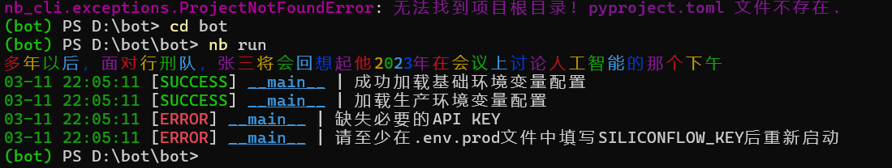
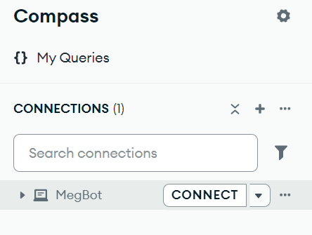
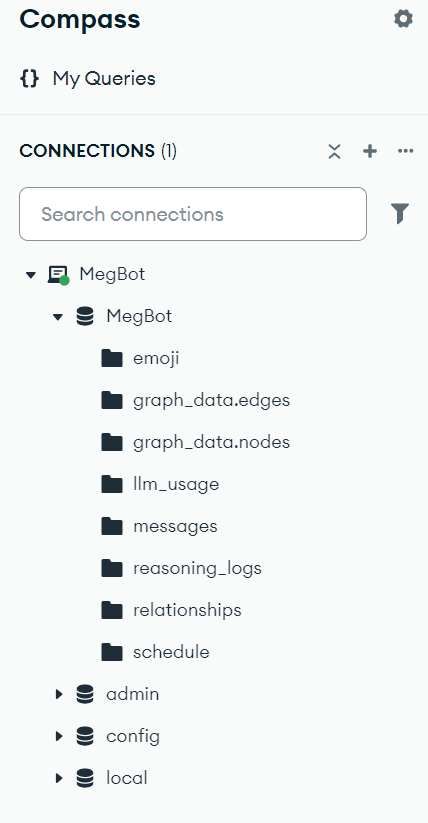

## 快速更新Q&A❓

 

- 这个文件用来记录一些常见的新手问题。

 

### 完整安装教程

 

[MaiMbot简易配置教程](https://www.bilibili.com/video/BV1zsQ5YCEE6)

 

### Api相关问题

 

 

- 为什么显示:"缺失必要的API KEY" ❓

 
  

  

---

 

> 
>
>你需要在 [Silicon Flow Api](https://cloud.siliconflow.cn/account/ak) 
>网站上注册一个账号，然后点击这个链接打开API KEY获取页面。
>
>点击 "新建API密钥" 按钮新建一个给MaiMBot使用的API KEY。不要忘了点击复制。
>
>之后打开MaiMBot在你电脑上的文件根目录，使用记事本或者其他文本编辑器打开 [.env.prod](../.env.prod) 
>这个文件。把你刚才复制的API KEY填入到 "SILICONFLOW_KEY=" 这个等号的右边。
>
>在默认情况下，MaiMBot使用的默认Api都是硅基流动的。
>
> 

 

 

- 我想使用硅基流动之外的Api网站，我应该怎么做 ❓

---

 

> 
>
>你需要使用记事本或者其他文本编辑器打开config目录下的 [bot_config.toml](../config/bot_config.toml) 
>然后修改其中的 "provider = " 字段。同时不要忘记模仿 [.env.prod](../.env.prod) 
>文件的写法添加 Api Key 和 Base URL。
>
>举个例子，如果你写了 " provider = \"ABC\" "，那你需要相应的在 [.env.prod](../.env.prod) 
>文件里添加形如 " ABC_BASE_URL = https://api.abc.com/v1 " 和 " ABC_KEY = sk-1145141919810 " 的字段。
>
>**如果你对AI没有较深的了解，修改识图模型和嵌入模型的provider字段可能会产生bug，因为你从Api网站调用了一个并不存在的模型**
>
>这个时候，你需要把字段的值改回 "provider = \"SILICONFLOW\" " 以此解决bug。
>
> 

 

### MongoDB相关问题

 

- 我应该怎么清空bot内存储的表情包 ❓

---

 

> 
>
>打开你的MongoDB Compass软件，你会在左上角看到这样的一个界面：
>
> 
>
>
>
> 
>
>点击 "CONNECT" 之后，点击展开 MegBot 标签栏
>
> 
>
>
>
> 
>
>点进 "emoji" 再点击 "DELETE" 删掉所有条目，如图所示
>
> 
>
>
>
> 
>
>你可以用类似的方式手动清空MaiMBot的所有服务器数据。
>
>MaiMBot的所有图片均储存在 [data](../data) 文件夹内，按类型分为 [emoji](../data/emoji) 和 [image](../data/image)
>
>在删除服务器数据时不要忘记清空这些图片。
>
> 

 

- 为什么我连接不上MongoDB服务器 ❓

---

> 
>
>这个问题比较复杂，但是你可以按照下面的步骤检查，看看具体是什么问题
>
> 
>
> 1. 检查有没有把 mongod.exe 所在的目录添加到 path。 具体可参照
>
> 
>
>&emsp;&emsp;[CSDN-windows10设置环境变量Path详细步骤](https://blog.csdn.net/flame_007/article/details/106401215)
>
> 
>
>&emsp;&emsp;**需要往path里填入的是 exe 所在的完整目录！不带 exe 本体**
>
> 
>
> 2. 待完成
>
> 