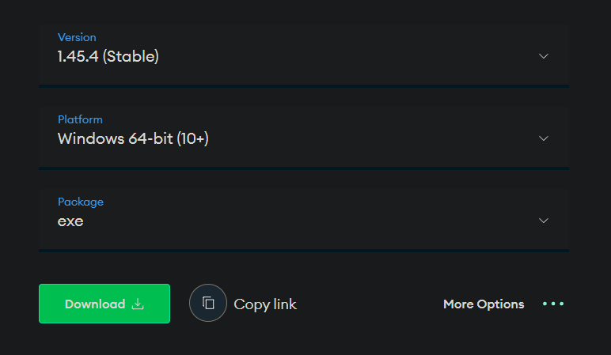
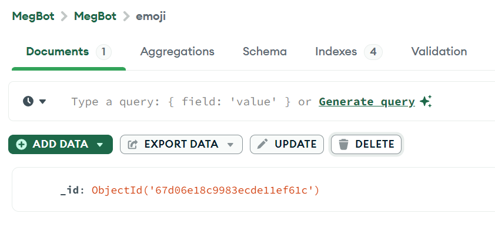

## 快速更新Q&A❓

- 这个文件用来记录一些常见的新手问题。

### 完整安装教程

[MaiMbot简易配置教程](https://www.bilibili.com/video/BV1zsQ5YCEE6)

### Api相关问题

- 为什么显示:"缺失必要的API KEY" ❓


>你需要在 [Silicon Flow Api](https://cloud.siliconflow.cn/account/ak) 网站上注册一个账号，然后点击这个链接打开API KEY获取页面。
>
>点击 "新建API密钥" 按钮新建一个给MaiMBot使用的API KEY。不要忘了点击复制。
>
>之后打开MaiMBot在你电脑上的文件根目录，使用记事本或者其他文本编辑器打开 [.env.prod](../.env.prod) 
>这个文件。把你刚才复制的API KEY填入到 `SILICONFLOW_KEY=` 这个等号的右边。
>
>在默认情况下，MaiMBot使用的默认Api都是硅基流动的。

---

- 我想使用硅基流动之外的Api网站，我应该怎么做 ❓

>你需要使用记事本或者其他文本编辑器打开config目录下的 [bot_config.toml](../config/bot_config.toml) 
>
>然后修改其中的 `provider = ` 字段。同时不要忘记模仿 [.env.prod](../.env.prod) 文件的写法添加 Api Key 和 Base URL。
>
>举个例子，如果你写了 `provider = "ABC"`，那你需要相应的在 [.env.prod](../.env.prod) 文件里添加形如 `ABC_BASE_URL = https://api.abc.com/v1` 和 `ABC_KEY = sk-1145141919810` 的字段。
>
>**如果你对AI模型没有较深的了解，修改识图模型和嵌入模型的provider字段可能会产生bug，因为你从Api网站调用了一个并不存在的模型**
>
>这个时候，你需要把字段的值改回 `provider = "SILICONFLOW"` 以此解决此问题。

### MongoDB相关问题

- 我应该怎么清空bot内存储的表情包 ❓
>需要先安装`MongoDB Compass`，[下载链接](https://www.mongodb.com/try/download/compass)，软件支持`macOS、Windows、Ubuntu、Redhat`系统
>以Windows为例，保持如图所示选项，点击`Download`即可，如果是其他系统，请在`Platform`中自行选择：
>

>打开你的MongoDB Compass软件，你会在左上角看到这样的一个界面：
>
>
>
><br>
>
>点击 "CONNECT" 之后，点击展开 MegBot 标签栏
>
>
>
><br>
>
>点进 "emoji" 再点击 "DELETE" 删掉所有条目，如图所示
>
>
>
><br>
>
>你可以用类似的方式手动清空MaiMBot的所有服务器数据。
>
>MaiMBot的所有图片均储存在 [data](../data) 文件夹内，按类型分为 [emoji](../data/emoji) 和 [image](../data/image)
>
>在删除服务器数据时不要忘记清空这些图片。

---

- 为什么我连接不上MongoDB服务器 ❓

>这个问题比较复杂，但是你可以按照下面的步骤检查，看看具体是什么问题


>#### Windows
> 1. 检查有没有把 mongod.exe 所在的目录添加到 path。 具体可参照
>
>&emsp;&emsp;[CSDN-windows10设置环境变量Path详细步骤](https://blog.csdn.net/flame_007/article/details/106401215)
>
>&emsp;&emsp;**需要往path里填入的是 exe 所在的完整目录！不带 exe 本体**
>
><br>
>
> 2. 环境变量添加完之后，可以按下`WIN+R`,在弹出的小框中输入`powershell`，回车，进入到powershell界面后，输入`mongod --version`如果有输出信息，就说明你的环境变量添加成功了。
>     接下来，直接输入`mongod --port 27017`命令(`--port`指定了端口，方便在可视化界面中连接)，如果连不上，很大可能会出现
>```shell
>"error":"NonExistentPath: Data directory \\data\\db not found. Create the missing directory or specify another path using (1) the --dbpath command line option, or (2) by adding the 'storage.dbPath' option in the configuration file."
>```
>这是因为你的C盘下没有`data\db`文件夹，mongo不知道将数据库文件存放在哪，不过不建议在C盘中添加,因为这样你的C盘负担会很大，可以通过`mongod --dbpath=PATH --port 27017`来执行，将`PATH`替换成你的自定义文件夹，但是不要放在mongodb的bin文件夹下！例如，你可以在D盘中创建一个mongodata文件夹，然后命令这样写
>```shell
>mongod --dbpath=D:\mongodata --port 27017
>```
>
>如果还是不行，有可能是因为你的27017端口被占用了
>通过命令
>```shell
> netstat -ano | findstr :27017
>```
>可以查看当前端口是否被占用，如果有输出,其一般的格式是这样的
>```shell
> TCP    127.0.0.1:27017        0.0.0.0:0              LISTENING       5764
> TCP    127.0.0.1:27017        127.0.0.1:63387        ESTABLISHED     5764
> TCP    127.0.0.1:27017        127.0.0.1:63388        ESTABLISHED     5764
> TCP    127.0.0.1:27017        127.0.0.1:63389        ESTABLISHED     5764
>```
>最后那个数字就是PID,通过以下命令查看是哪些进程正在占用
>```shell
>tasklist /FI "PID eq 5764"
>```
>如果是无关紧要的进程，可以通过`taskkill`命令关闭掉它，例如`Taskkill /F /PID 5764`
>
>如果你对命令行实在不熟悉，可以通过`Ctrl+Shift+Esc`调出任务管理器，在搜索框中输入PID，也可以找到相应的进程。
>
>如果你害怕关掉重要进程，可以修改`.env.dev`中的`MONGODB_PORT`为其它值，并在启动时同时修改`--port`参数为一样的值
>```ini
>MONGODB_HOST=127.0.0.1
>MONGODB_PORT=27017 #修改这里
>DATABASE_NAME=MegBot
>```

<details>
<summary>Linux（点击展开）</summary>

#### **1. 检查 MongoDB 服务是否运行**
- **命令**：
  ```bash
  systemctl status mongod      # 检查服务状态（Ubuntu/Debian/CentOS 7+）
  service mongod status        # 旧版系统（如 CentOS 6）
  ```
- **可能结果**：
  - 如果显示 `active (running)`，服务已启动。
  - 如果未运行，启动服务：
    ```bash
    sudo systemctl start mongod    # 启动服务
    sudo systemctl enable mongod   # 设置开机自启
    ```

---

#### **2. 检查 MongoDB 端口监听**
MongoDB 默认使用 **27017** 端口。  
- **检查端口是否被监听**：
  ```bash
  sudo ss -tulnp | grep 27017    
  或
  sudo netstat -tulnp | grep 27017
  ```
- **预期结果**：
  ```bash
  tcp  LISTEN 0 128  0.0.0.0:27017  0.0.0.0:*  users:(("mongod",pid=123,fd=11))
  ```
  - 如果无输出，说明 MongoDB 未监听端口。


---
#### **3. 检查防火墙设置**
- **Ubuntu/Debian（UFW 防火墙）**：
  ```bash
  sudo ufw status                  # 查看防火墙状态
  sudo ufw allow 27017/tcp         # 开放 27017 端口
  sudo ufw reload                  # 重新加载规则
  ```
- **CentOS/RHEL（firewalld）**：
  ```bash
  sudo firewall-cmd --list-ports                   # 查看已开放端口
  sudo firewall-cmd --add-port=27017/tcp --permanent  # 永久开放端口
  sudo firewall-cmd --reload                       # 重新加载
  ```
- **云服务器用户注意**：检查云平台安全组规则，确保放行 27017 端口。

---

#### **4. 检查端口占用**
如果 MongoDB 服务无法监听端口，可能是其他进程占用了 `27017` 端口。  
- **检查端口占用进程**：
  ```bash
  sudo lsof -i :27017          # 查看占用 27017 端口的进程
  或
  sudo ss -ltnp 'sport = :27017'  # 使用 ss 过滤端口
  ```
- **结果示例**：
  ```bash
  COMMAND  PID USER   FD TYPE DEVICE SIZE/OFF NODE NAME
  java    1234 root   12u IPv4 123456      0t0  TCP *:27017 (LISTEN)
  ```
  - 输出会显示占用端口的 **进程名** 和 **PID**（此处 `PID=1234`）。

- **解决方案**：
  1. **终止占用进程**（谨慎操作！确保进程非关键）：
     ```bash
     sudo kill 1234                  # 正常终止进程
     sudo kill -9 1234               # 强制终止（若正常终止无效）
     ```
  2. **修改端口**：  
     编辑麦麦目录里的`.env.dev`文件，修改端口号：
  ```ini
  MONGODB_HOST=127.0.0.1
  MONGODB_PORT=27017 #修改这里
  DATABASE_NAME=MegBot
  ```


##### **注意事项**
- 终止进程前，务必确认该进程非系统关键服务（如未知进程占用，建议先排查来源），如果你不知道这个进程是否关键，请更改端口使用。

</details>

<details>
<summary>macOS（点击展开）</summary>

### **1. 检查 MongoDB 服务状态**
**问题原因**：MongoDB 服务未启动  
**操作步骤**：
```bash
# 查看 MongoDB 是否正在运行（Homebrew 安装的默认服务名）
brew services list | grep mongodb

# 如果状态为 "stopped" 或 "error"，手动启动
brew services start mongodb-community@8.0  
```
✅ **预期结果**：输出显示 `started` 或 `running`  
❌ **失败处理**：  
- 若报错 `unrecognized service`，可能未正确安装 MongoDB，建议[重新安装](https://www.mongodb.com/docs/manual/tutorial/install-mongodb-on-os-x/#install-mongodb-community-edition)。

---

### **2. 检查端口是否被占用**
**问题原因**：其他程序占用了 MongoDB 的默认端口（`27017`），导致服务无法启动或连接  
**操作步骤**：
```bash
# 检查 27017 端口占用情况（需 sudo 权限查看完整信息）
sudo lsof -i :27017

# 或使用 netstat 快速检测
netstat -an | grep 27017
```
✅ **预期结果**：  
- 若无 MongoDB 运行，应无输出  
- 若 MongoDB 已启动，应显示 `mongod` 进程  

❌ **发现端口被占用**：  
#### **解决方案1：终止占用进程**
1. 从 `lsof` 输出中找到占用端口的 **PID**（进程号）  
2. 强制终止该进程（谨慎操作！确保进程非关键）：
   ```bash
   kill -9 PID  # 替换 PID 为实际数字（例如 kill -9 12345）
   ```
3. 重新启动 MongoDB 服务：
   ```bash
   brew services start mongodb-community@8.0
   ```

#### **解决方案2：修改端口**
   编辑麦麦目录里的`.env.dev`文件，修改端口号：
  ```ini
  MONGODB_HOST=127.0.0.1
  MONGODB_PORT=27017 #修改这里
  DATABASE_NAME=MegBot
  ```

---

### **3. 检查防火墙设置**
**问题原因**：macOS 防火墙阻止连接  
**操作步骤**：  
1. 打开 **系统设置 > 隐私与安全性 > 防火墙**  
2. 临时关闭防火墙测试连接  
3. 若需长期开放，添加 MongoDB 到防火墙允许列表（通过终端或 GUI）。


---
### **4. 重置 MongoDB 环境**
***仅在以上步骤都无效时使用***
**适用场景**：配置混乱导致无法修复  
```bash
# 停止服务并删除数据
brew services stop mongodb-community@8.0
rm -rf /usr/local/var/mongodb

# 重新初始化（确保目录权限）
sudo mkdir -p /usr/local/var/mongodb
sudo chown -R $(whoami) /usr/local/var/mongodb

# 重新启动
brew services start mongodb-community@8.0
```

</details>