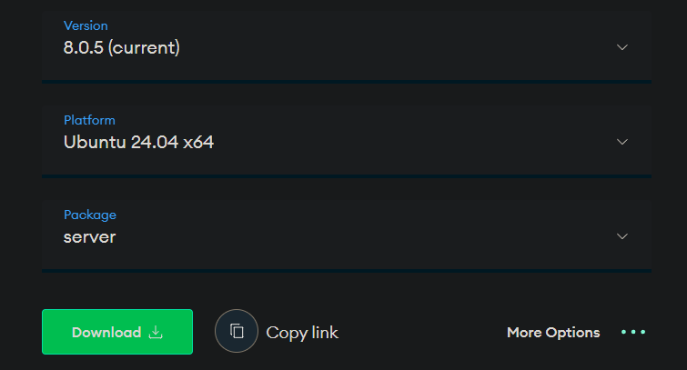
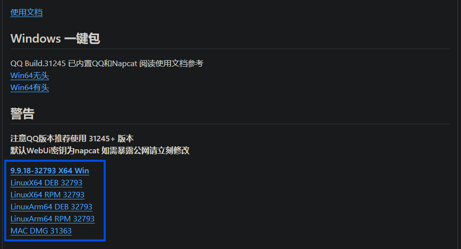
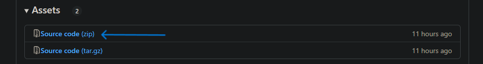

# 面向纯新手的Linux服务器麦麦部署指南


## 事前准备
为了能使麦麦不间断的运行，你需要一台一直开着的服务器。

### 如果你想购买服务器
华为云、阿里云、腾讯云等等都是在国内可以选择的选择。

租一台最低配置的就足敷需要了，按月租大概十几块钱就能租到了。

### 如果你不想购买服务器
你可以准备一台可以一直开着的电脑/主机，只需要保证能够正常访问互联网即可

**下文将统称它们为`服务器`**

我们假设你已经有了一台Linux架构的服务器。举例使用的是Ubuntu24.04，其他的原理相似。

## 0.我们就从零开始吧

### 网络问题

为访问Github相关界面，推荐去下一款加速器，新手可以试试[Watt Toolkit](https://gitee.com/rmbgame/SteamTools/releases/latest)。

### 安装包下载

#### MongoDB
进入[MongoDB下载页](https://www.mongodb.com/try/download/community-kubernetes-operator)，并选择版本

以Ubuntu24.04 x86为例，保持如图所示选项，点击`Download`即可，如果是其他系统，请在`Platform`中自行选择：




不想使用上述方式？你也可以参考[官方文档](https://www.mongodb.com/zh-cn/docs/manual/administration/install-on-linux/#std-label-install-mdb-community-edition-linux)进行安装，进入后选择自己的系统版本即可

#### QQ（可选）/Napcat
*如果你使用Napcat的脚本安装，可以忽略此步*
访问https://github.com/NapNeko/NapCatQQ/releases/latest
在图中所示区域可以找到QQ的下载链接，选择对应版本下载即可
从这里下载，可以保证你下载到的QQ版本兼容最新版Napcat

如果你不想使用Napcat的脚本安装，还需参考[Napcat-Linux手动安装](https://www.napcat.wiki/guide/boot/Shell-Linux-SemiAuto)

#### 麦麦

先打开https://github.com/MaiM-with-u/MaiBot/releases
往下滑找到这个

下载箭头所指这个压缩包。

### 路径

我把麦麦相关文件放在了/moi/mai里面，你可以凭喜好更改，记得适当调整下面涉及到的部分即可。

文件结构：

```
moi
└─ mai
   ├─ linuxqq_3.2.16-32793_amd64.deb   # linuxqq安装包
   ├─ mongodb-org-server_8.0.5_amd64.deb  # MongoDB的安装包
   └─ bot
      └─ MaiMBot-0.5.8-alpha.zip # 麦麦的压缩包
```

### 网络

你可以在你的服务器控制台网页更改防火墙规则，允许6099，8080，27017这几个端口的出入。

## 1.正式开始！

远程连接你的服务器，你会看到一个黑框框闪着白方格，这就是我们要进行设置的场所——终端了。以下的bash命令都是在这里输入。

## 2. Python的安装

- 导入 Python 的稳定版 PPA（Ubuntu需执行此步，Debian可忽略）：

```bash
sudo add-apt-repository ppa:deadsnakes/ppa
```

- 导入 PPA 后，更新 APT 缓存：

```bash
sudo apt update
```

- 在「终端」中执行以下命令来安装 Python 3.12：

```bash
sudo apt install python3.12
```

- 验证安装是否成功：

```bash
python3.12 --version
```
- （可选）更新替代方案，设置 python3.12 为默认的 python3 版本:
```bash
sudo update-alternatives --install /usr/bin/python3 python3 /usr/bin/python3.12 1
sudo update-alternatives --config python3
```

- 在「终端」中，执行以下命令安装 pip：

```bash
sudo apt install python3-pip
```

- 检查Pip是否安装成功：

```bash
pip --version
```

- 安装必要组件

``` bash
sudo apt install python-is-python3
```

## 3.MongoDB的安装
*如果你是参考[官方文档](https://www.mongodb.com/zh-cn/docs/manual/administration/install-on-linux/#std-label-install-mdb-community-edition-linux)进行安装的，可跳过此步*

``` bash
cd /moi/mai
```

``` bash
dpkg -i mongodb-org-server_8.0.5_amd64.deb
```

``` bash
mkdir -p /root/data/mongodb/{data,log}
```

## 4.MongoDB的运行

```bash
service mongod start
```

```bash
systemctl status mongod #通过这条指令检查运行状态
```

有需要的话可以把这个服务注册成开机自启

```bash
sudo systemctl enable mongod
```

## 5.Napcat的安装

``` bash
# 该脚本适用于支持Ubuntu 20+/Debian 10+/Centos9
curl -o napcat.sh https://nclatest.znin.net/NapNeko/NapCat-Installer/main/script/install.sh && sudo bash napcat.sh
```
执行后，脚本会自动帮你部署好QQ及Napcat
*注：如果你已经手动安装了Napcat和QQ，可忽略此步*

成功的标志是输入``` napcat ```出来炫酷的彩虹色界面

## 6.Napcat的运行

此时你就可以根据提示在```napcat```里面登录你的QQ号了。

```bash
napcat start <你的QQ号>
napcat status #检查运行状态
```

然后你就可以登录napcat的webui进行设置了：

```http://<你服务器的公网IP>:6099/webui?token=napcat```

如果你部署在自己的电脑上：
```http://127.0.0.1:6099/webui?token=napcat```

> [!WARNING]
> 如果你的麦麦部署在公网，请**务必**修改Napcat的默认密码


第一次是这个，后续改了密码之后token就会对应修改。你也可以使用```napcat log <你的QQ号>```来查看webui地址。把里面的```127.0.0.1```改成<你服务器的公网IP>即可。

登录上之后在网络配置界面添加websocket客户端，名称随便输一个，url改成`ws://127.0.0.1:8080/onebot/v11/ws`保存之后点启用，就大功告成了。

## 7.麦麦的安装

### step 1 安装解压软件

```bash
sudo apt-get install unzip
```

### step 2 解压文件

```bash
cd /moi/mai/bot # 注意：要切换到压缩包的目录中去
unzip MaiMBot-0.5.8-alpha.zip
```

### step 3 进入虚拟环境安装库

```bash
cd /moi/mai/bot
python -m venv venv
source venv/bin/activate
pip install -r requirements.txt
```

### step 4 试运行

```bash
cd /moi/mai/bot
python -m venv venv
source venv/bin/activate
python bot.py
```

肯定运行不成功，不过你会发现结束之后多了一些文件

```
bot
├─ .env.prod
└─ config
   └─ bot_config.toml
```

你可以使用vim、nano等编辑器直接在终端里修改这些配置文件，但如果你不熟悉它们的操作，也可以使用带图形界面的编辑器。
如果你的麦麦部署在远程服务器，也可以把它们下载到本地改好再传上去

### step 5 文件配置

本项目需要配置两个主要文件：

1. `.env.prod` - 配置API服务和系统环境
2. `bot_config.toml` - 配置机器人行为和模型

#### API

你可以注册一个硅基流动的账号，通过邀请码注册有14块钱的免费额度：https://cloud.siliconflow.cn/i/7Yld7cfg。

#### 修改配置文件
请参考
- [🎀 新手配置指南](./installation_cute.md) - 通俗易懂的配置教程，适合初次使用的猫娘
- [⚙️ 标准配置指南](./installation_standard.md) - 简明专业的配置说明，适合有经验的用户


### step 6 运行

现在再运行

```bash
cd /moi/mai/bot
python -m venv venv
source venv/bin/activate
python bot.py
```

应该就能运行成功了。

## 8.事后配置

可是现在还有个问题：只要你一关闭终端，bot.py就会停止运行。那该怎么办呢？我们可以把bot.py注册成服务。

重启服务器，打开MongoDB和napcat服务。

新建一个文件，名为`bot.service`，内容如下

```
[Unit]
Description=maimai bot

[Service]
WorkingDirectory=/moi/mai/bot
ExecStart=/moi/mai/bot/venv/bin/python /moi/mai/bot/bot.py
Restart=on-failure
User=root

[Install]
WantedBy=multi-user.target
```

里面的路径视自己的情况更改。

把它放到`/etc/systemd/system`里面。

重新加载 `systemd` 配置：

```bash
sudo systemctl daemon-reload
```

启动服务：

```bash
sudo systemctl start bot.service # 启动服务
sudo systemctl restart bot.service # 或者重启服务
```

检查服务状态：

```bash
sudo systemctl status bot.service
```

现在再关闭终端，检查麦麦能不能正常回复QQ信息。如果可以的话就大功告成了！

## 9.命令速查

```bash
service mongod start # 启动mongod服务
napcat start <你的QQ号> # 登录napcat
cd /moi/mai/bot # 切换路径
python -m venv venv # 创建虚拟环境
source venv/bin/activate # 激活虚拟环境

sudo systemctl daemon-reload # 重新加载systemd配置
sudo systemctl start bot.service # 启动bot服务
sudo systemctl enable bot.service # 启动bot服务

sudo systemctl status bot.service # 检查bot服务状态
```

```bash
python bot.py  # 运行麦麦
```

