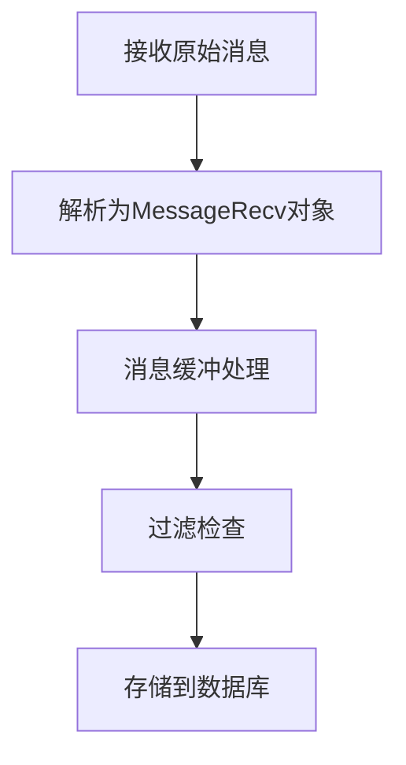
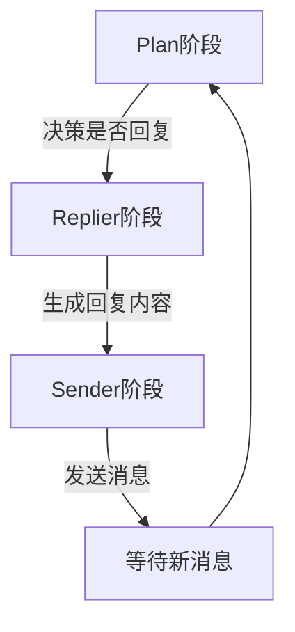
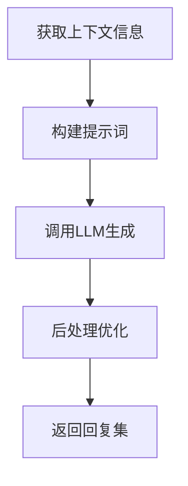
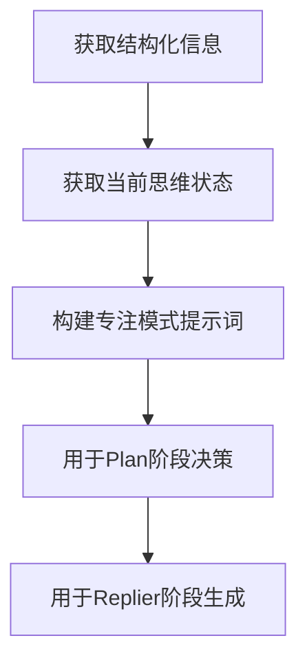

# HeartFC_chat 工作原理文档

HeartFC_chat 是一个基于心流理论的聊天系统，通过模拟人类的思维过程和情感变化来实现自然的对话交互。系统采用Plan-Replier-Sender循环机制，实现了智能化的对话决策和生成。

## 核心工作流程

### 1. 消息处理与存储 (HeartFCProcessor)
[代码位置: src/plugins/heartFC_chat/heartflow_processor.py]

消息处理器负责接收和预处理消息，主要完成以下工作：

核心实现：
- 消息处理入口：`process_message()` [行号: 38-215]
  - 消息解析和缓冲：`message_buffer.start_caching_messages()` [行号: 63]
  - 过滤检查：`_check_ban_words()`, `_check_ban_regex()` [行号: 196-215]
  - 消息存储：`storage.store_message()` [行号: 108]

### 2. 对话管理循环 (HeartFChatting)
[代码位置: src/plugins/heartFC_chat/heartFC_chat.py]

HeartFChatting是系统的核心组件，实现了完整的对话管理循环：

#### Plan阶段 [行号: 282-386]
- 主要函数：`_planner()`
- 功能实现：
  * 获取观察信息：`observation.observe()` [行号: 297]
  * 思维处理：`sub_mind.do_thinking_before_reply()` [行号: 301]
  * LLM决策：使用`PLANNER_TOOL_DEFINITION`进行动作规划 [行号: 13-42]

#### Replier阶段 [行号: 388-416]
- 主要函数：`_replier_work()`
- 调用生成器：`gpt_instance.generate_response()` [行号: 394]
- 处理生成结果和错误情况

#### Sender阶段 [行号: 418-450]
- 主要函数：`_sender()`
- 发送实现：
  * 创建消息：`_create_thinking_message()` [行号: 452-477]
  * 发送回复：`_send_response_messages()` [行号: 479-525]
  * 处理表情：`_handle_emoji()` [行号: 527-567]

### 3. 回复生成机制 (HeartFCGenerator)
[代码位置: src/plugins/heartFC_chat/heartFC_generator.py]

回复生成器负责产生高质量的回复内容：

核心实现：
- 生成入口：`generate_response()` [行号: 39-67]
  * 情感调节：`arousal_multiplier = MoodManager.get_instance().get_arousal_multiplier()` [行号: 47]
  * 模型生成：`_generate_response_with_model()` [行号: 69-95]
  * 响应处理：`_process_response()` [行号: 97-106]

### 4. 提示词构建系统 (HeartFlowPromptBuilder)
[代码位置: src/plugins/heartFC_chat/heartflow_prompt_builder.py]

提示词构建器支持两种工作模式，HeartFC_chat专门使用Focus模式，而Normal模式是为normal_chat设计的：

#### 专注模式 (Focus Mode) - HeartFC_chat专用
- 实现函数：`_build_prompt_focus()` [行号: 116-141]
- 特点：
  * 专注于当前对话状态和思维
  * 更强的目标导向性
  * 用于HeartFC_chat的Plan-Replier-Sender循环
  * 简化的上下文处理，专注于决策

#### 普通模式 (Normal Mode) - Normal_chat专用
- 实现函数：`_build_prompt_normal()` [行号: 143-215]
- 特点：
  * 用于normal_chat的常规对话
  * 完整的个性化处理
  * 关系系统集成
  * 知识库检索：`get_prompt_info()` [行号: 217-591]

HeartFC_chat的Focus模式工作流程：

## 智能特性

### 1. 对话决策机制
- LLM决策工具定义：`PLANNER_TOOL_DEFINITION` [heartFC_chat.py 行号: 13-42]
- 决策执行：`_planner()` [heartFC_chat.py 行号: 282-386]
- 考虑因素：
  * 上下文相关性
  * 情感状态
  * 兴趣程度
  * 对话时机

### 2. 状态管理
[代码位置: src/plugins/heartFC_chat/heartFC_chat.py]
- 状态机实现：`HeartFChatting`类 [行号: 44-567]
- 核心功能：
  * 初始化：`_initialize()` [行号: 89-112]
  * 循环控制：`_run_pf_loop()` [行号: 192-281]
  * 状态转换：`_handle_loop_completion()` [行号: 166-190]

### 3. 回复生成策略
[代码位置: src/plugins/heartFC_chat/heartFC_generator.py]
- 温度调节：`current_model.temperature = global_config.llm_normal["temp"] * arousal_multiplier` [行号: 48]
- 生成控制：`_generate_response_with_model()` [行号: 69-95]
- 响应处理：`_process_response()` [行号: 97-106]

## 系统配置

### 关键参数
- LLM配置：`model_normal` [heartFC_generator.py 行号: 32-37]
- 过滤规则：`_check_ban_words()`, `_check_ban_regex()` [heartflow_processor.py 行号: 196-215]
- 状态控制：`INITIAL_DURATION = 60.0` [heartFC_chat.py 行号: 11]

### 优化建议
1. 调整LLM参数：`temperature`和`max_tokens`
2. 优化提示词模板：`init_prompt()` [heartflow_prompt_builder.py 行号: 8-115]
3. 配置状态转换条件
4. 维护过滤规则

## 注意事项

1. 系统稳定性
- 异常处理：各主要函数都包含try-except块
- 状态检查：`_processing_lock`确保并发安全
- 循环控制：`_loop_active`和`_loop_task`管理

2. 性能优化
- 缓存使用：`message_buffer`系统
- LLM调用优化：批量处理和复用
- 异步处理：使用`asyncio`

3. 质量控制
- 日志记录：使用`get_module_logger()`
- 错误追踪：详细的异常记录
- 响应监控：完整的状态跟踪
